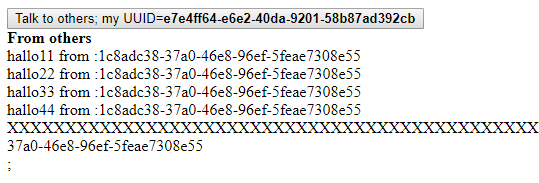
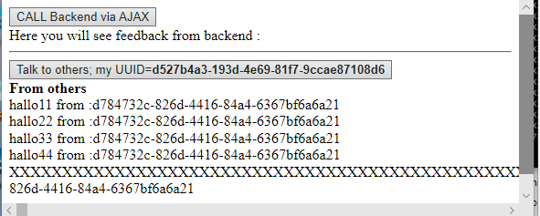

# Example

## socketWebClient.js

Use this JavaScript to connect to the server.

The server sends JSON encoded messages in the form of
`{'opcode':code, /*messag depeding on opcode*/}`
Opcodes that are handled inside this script.  
- ready
- next
- close

**Note** every message send to the server is acknowledged by the server  
with an opcode 'next'.

This script handles my required dialog right after the handshake is done and the connection  
is established.

- the server sends opcode 'ready' 
- the script sends back a generated UUID. `{'opcode':'uuid', 'message':uuid}`  
With this UUID the client registers with the server  
- The serve sends a message with opcode 'next'  
signaling that the client can send the next message.

This script also sends very long messages in chunks of `chunksize=6 * 1204`.  

## testWithWebSocket.php

Example to SHOW `broadcast` from other web clients and `feedback` from  
a backend script.

Have the server started and waiting ....

**Step 1**

In a browser window open `http://your.web.server/testWithWebSocket.php`.  
You will see this when you perform **Step 2**

**Step 2**

In an other browser window open `http://your.web.server/testWithWebSocket.php`.  
This will broadcast into the page you opened  in **Step 1**.  
Press the button in the page you opened in **Step 1** then you will see the output below

